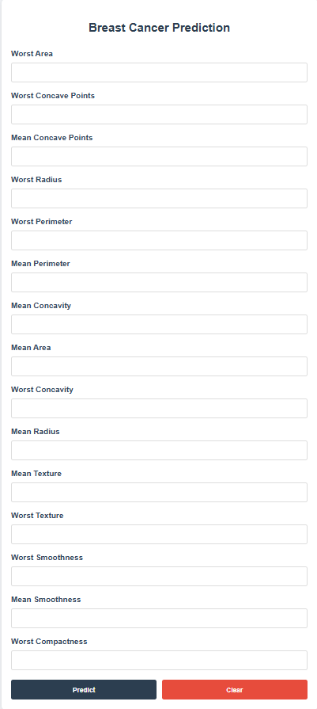

# 🧬 Breast Cancer Prediction

This is a Flask-based machine learning web app that predicts whether a tumor is **Benign (No Cancer)** or **Malignant (Cancer)** based on 15 input features from a breast cancer dataset.

## 📸 Screenshot



## 🚀 Tech Stack

- Python
- Flask
- HTML/CSS
- Scikit-learn
- Joblib
- NumPy
- Bootstrap (minimal styling)
- Jinja2 Templating

## 🧠 ML Details

- Model: Random Forest Classifier
- Data: Breast Cancer dataset from `sklearn.datasets`
- Preprocessing: StandardScaler
- Top 15 Features used (from correlation and importance)

## 🗂️ Files Included

- `app.py` → Flask app
- `model.pkl` → Trained ML model
- `scaler.pkl` → Fitted StandardScaler
- `features.pkl` → Selected feature names
- `templates/index.html` → HTML Form UI
- `static/style.css` → Styling

## ⚙️ How to Run Locally

1. Clone the repo:
    ```bash
    git clone https://github.com/your-username/breast-cancer-predictor.git
    ```

2. Move into the directory:
    ```bash
    cd breast-cancer-predictor
    ```

3. Create a virtual environment (optional but recommended):
    ```bash
    python -m venv venv
    source venv/bin/activate  # On Windows: venv\Scripts\activate
    ```

4. Install dependencies:
    ```bash
    pip install -r requirements.txt
    ```

5. Run the app:
    ```bash
    python app.py
    ```

6. Visit: [http://127.0.0.1:5000](http://127.0.0.1:5000)

---

## 🤝 Contributing

Pull requests are welcome! For major changes, open an issue first to discuss what you would like to change.

---

## 📄 License

This project is open-source under the MIT License.
